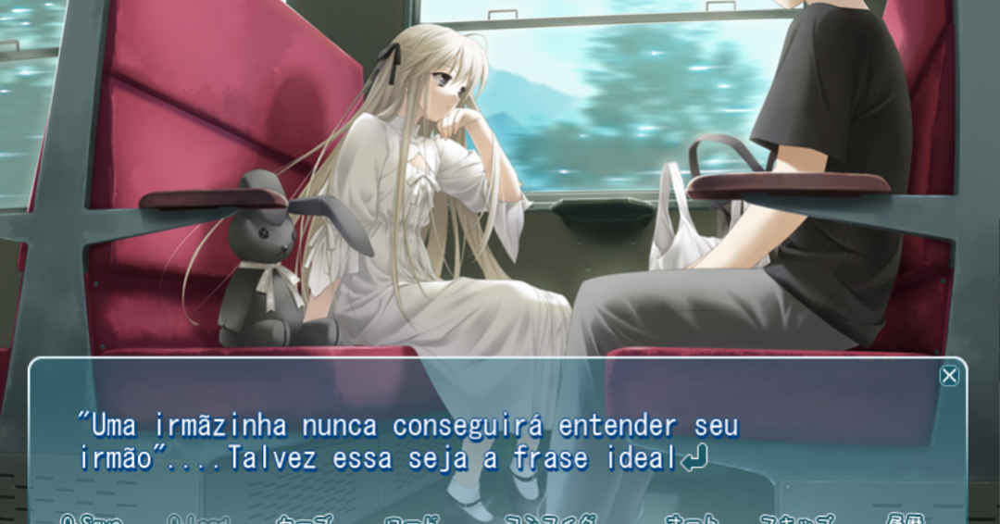

**Na solidão, onde estamos pelo menos sozinhos.**

Tradução de Yosuga no Sora para o PT-BR(Português Brasil)

:::danger Leia antes

Isso é um patch feito de fãs para fãs sem nenhum fim lucrativo. Também não disponibilizamos o jogo aqui, só o patch.

:::

# Yosuga no Sora

## Sinopse

Haruka junto com sua irmã gêmea Sora perderam seus pais em um acidente de carro. Devido à tragédia, os dois voltaram para a cidade do interior chamada Okukosome e agora vivem na antiga casa onde o avô deles trabalhava como médico. Suas boas e velhas memórias da cidade silenciosamente curam suas tristezas.... No entanto, sua vida pacífica muda gradualmente.... Uma promessa secreta feita há muito tempo. Um tesouro perdido. Um verdadeiro motivo para se mudar para a cidade e além disso, sentimentos reais. A história agora começa sob o sol do verão ...

## Progresso

| Rota         | Traduzida | Revisão |
|--------------|-----------|------------|
| Comum        | **100%**  | *???*      |
| Sora         | **100%**  | *???*      |
| Motoka       | Sendo traduzida  | 0%     |
| Akira        | 0%  | 0%    |
| Migiwa      | 0% | 0%    |
| Nao         | 0% | 0%    |

## Créditos

**HanabiWorks**
- **Rin chan** - Tradução
- **Alexandre Doppel** - Revisão

**Contribuidores**
- **Gopicolo** - Feedback

**Outros**
- **Mad** - Responsável pela tradução gringa
- **MrWicked** - Ferramentas
- **Sphere** - Pelo lançamento do jogo

Nota: *Só foram mencionadas em HanabiWorks as pessoas que exerceram sua função em pelo menos 15% do projeto*

## Instalação

**1-** Baixe o Patch abaixo

:::caution Aviso

O patch não é compatível com a versão digital da DMM, porém o patch pra ela está sendo trabalhado.

:::

- **Yosuga no sora** - `24/06/2021`: [Download](https://www.mediafire.com/file/l8qg086womn92vy/Rota_Sora_Ver-1.0.rar/file)

- *Patch parcial contendo rota comum e da Sora*

**2-** Instale na pasta do jogo

- Coloque o arquivo `yosuga.csx` no diretório `C:\Program Files (x86)\Sphere\ヨスガノソラ\system` ou no diretório que você instalou o jogo.

**3(extra)-** Acesso a rota da Sora como primeira rota.

*O jogo só libera a rota da Sora caso você já tenha completado pelo menos uma rota antes. Então caso você queira jogar a rota dela primeiro, o procedimento é o seguite:*

- Coloque o arquivo `system.dat` nesse diretório `C:\Users\(seu nome de usuário)\AppData\Roaming\Sphere\Yosuga\save`

## Perguntas frequentes

**O patch é compatível com qual versão?**
- Apenas com a versão de DVD/CD do jogo. Porém, caso você tenha a versão da DMM, temos um port dela [aqui](https://www.mediafire.com/file/d8yu5tfwtpxlnh8/patch.xp3/file)

**Tem para Android?**
- No momento não, porém será feito um port pra android assim que a tradução e revisão for concluida.

**Minha pergunta não está aqui**
- Entre no Discord

